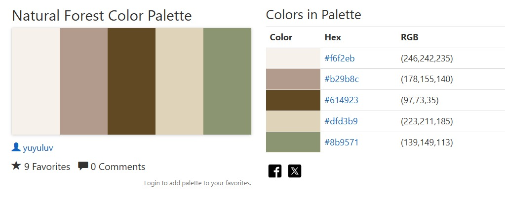

La cafetería Luna & Granos Café quiere modernizar su presencia online. Nos pidieron
crear una aplicación web en React donde los clientes puedan ver la carta de productos,
armar pedidos simples y enviar consultas o reservas. El sitio debe verse bien en celulares y
transmitir una experiencia moderna y amigable

Para ingresar al proyecto se debe:
1) En la terminal del Visual Studio Code (O la aplicacion que se utilice) ingresar en terminal "git clone "https://github.com/Evhal9/CafeteriaOnline".
2) En terminal ingresar "npm install".
3) Luego de finalizar la descarga de los paquetes, ingresar en terminal "npm run dev" y luego ctrl+click en el url que aparezca en la pantalla de la terminal.

Documentacion:
Se eligieron los siguientes colores para realizar el proyecto

Para transmitir un ambiente ecofriendly y calido al cliente.

Cuenta con las siguientes carpetas:
public-> Imagenes estaticas que no son procesadas/modificadas/utilizadas por jsx

src/assets -> imagenes que deben ser procesadas 

src/componentes -> ~AppRoutes.jsx: Contiene las rutas para navegar por el proyecto.
                -> ~Header.jsx: Contiene la estrucutura del navegador.
                -> ~Header.css: Contiene los estilos para la estructura del header.
                -> ~SelectorOpciones.jsx: Modal para seleccionar opciones y cantidades de productos.
                -> ~SelectorOpciones.css: Estilos del modal de opciones.
                -> ~MiniCarrito.jsx: Carrito flotante que muestra items agregados
                -> ~MiniCarrito.css: Estilos del mini-carrito

src/pages:  -> ~Inicio.jsx: Página principal con banner promocional
            -> ~Inicio.css: Estilos de la página de inicio
            -> ~Carta.jsx: Página principal con lista de productos y sistema de pedidos
            -> ~Carta.css: Estilos de la página de carta
            -> ~Carrito.jsx: Página completa del carrito de compras
            -> ~Carrito.css: Estilos de la página de carrito
            -> ~Contacto.jsx: Página de contacto (en desarrollo)
            -> ~Nosotros.jsx: Página "Sobre nosotros" (en desarrollo)

src/context:    -> ~CarritoContext.jsx: Context API para manejo global del estado del carrito.

src/data:   -> ~productos.js: Base de datos de productos con opciones y precios

src/hooks:  -> ~useCarrito.js: Hook personalizado para acceder al contexto del carrito

App.css -> Estilos del componente App

App.jsx -> Componente principal de la aplicación

index.css -> Contiene los estilos globales para todo el proyecto

main.jsx -> Punto de entrada de la aplicación

### Funcionalidades Implementadas

- **Carta interactiva** con productos por categorías
- **Sistema de opciones** (tamaños, variantes) por producto
- **Carrito en tiempo real** con mini-carrito flotante
- **Gestión de pedidos** (agregar, eliminar, modificar cantidades)
- **Navegación SPA** con React Router